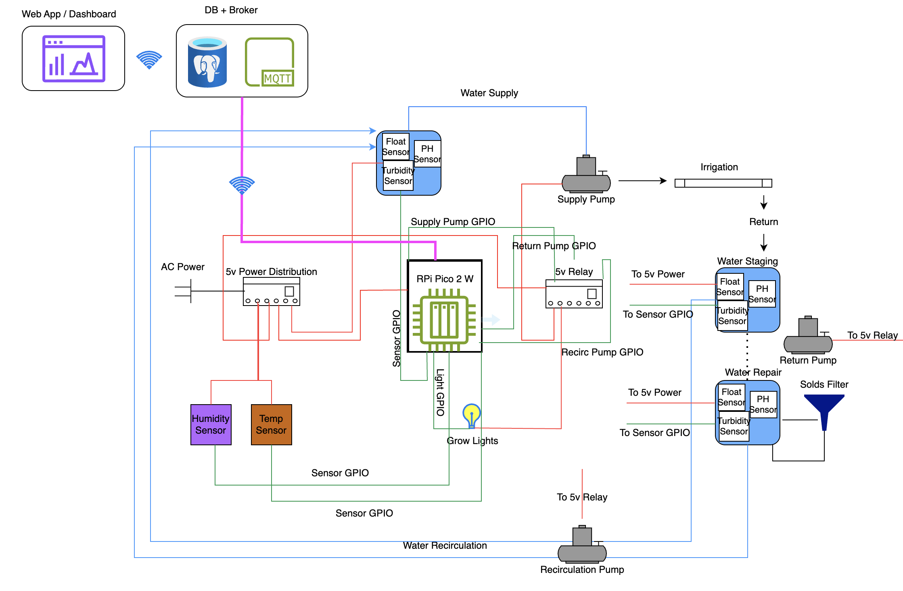

# BHCS
Busen Hydroponic Control System

This is my attempt to build a hydroponic control system for high-volume fodder production.  The system uses commodity parts to keep the cost down as well as leveraging a Raspberry Pi Pico 2 W controller as the brains of the system.

The scope of this project includes not only the control of the growing system, but also a water reclamation system to save on water.  Additionally metrics, dashboarding and remote control will be future enhancements.  This architecture is planned to change.

## License Notice
This project is proprietary and **all rights are reserved**.  
Use, copying, modification, or distribution of this code **without explicit written permission** from the author is strictly prohibited.

## This project is for the development of a hydroponic control system

